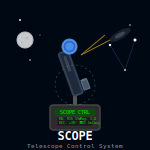

# hp-41_scope

## HP-41: Telescope and observational utility

This program calculates values for telescopes and eyepieces. You start the program, add a telescope and then as many eyepieces as you want. You can then view several values for the telescope as well as the details for each eyepiece when used with this telescope. 

Scopes are stored in the extended memory data file, "SC". Eyepieces are stored in the extended memory data file, "EP". The program will create either file when you first try to view or add a scope or an eyepiece.

There are two ways to add a scope. Press "A" to view your scopes. If you haven't added any scopes yet, you will be asked to add a scope. As with any scope value, you can simply enter a new value and press R/S. As you view the scopes you have stored and come to the end, you will be asked if you want to add another scope. Press R/S to add a new scope to the list. Press "e" to go back to the main menu instead. If you have many scopes, you may want to press "a" instead of going through all the scopes until you get to an empty scope at the end to enter a new name/aperture/focal length set. The same goes for eyepieces - press "C" to show/edit each eyepiece or press "c" to add a new one at the end of the data set.

You select a scope or eyepiece, view the scope or eyepiece you want to select (via "A" for scopes or "C" for eyepieces") and let the program show you the name of the item and the two properties ("APP" and "FL" for scope aperture or focal length, "FL" and "AFOV" for eyepiece focal length or apparent field of view). The program will sound a high tone when the name and the two values have been shown (and stored). You may then press "B" to show the calculated values for that scope or "D" to show the calculated value for the scope/eyepiece combination.

Upon **XEQ "SCOPE"**, the program give you the menu "S cS E cE S:E" for the unshifted top row keys. After pressing R/S, it will show the menu "+S - +E - M" for the shifted top row keys. Pressing R/S again takes the program to LBL E and shows the current selection of scope/eyepiece.

Label (Menu) |Description
-------------|-----------
LBL A (S)    |Show/edit scopes - scope name (max 6 characters), the aperture and focal length are in millimeters.
LBL B (cS)   |Calculate scope values (see table below)
LBL C (e)    |Show/edit eyepieces - eyepiece name (max 6 characters), focal length is in millimeters and the apparent field of view (AFOV) is in degrees
LBL D (cE)   |Calculate scope/eyepiece values (see table below)
LBL E (S:E)  |Show the currently selected scope/eyepiece combination
             | 
LBL a (+S)   |Add a new scope at the end of the scope data file
LBL b (-)    |Remove the last scope in the scope file (SC)
LBL c (+E)   |Add a new eyepiece at the end of the eyepiece data file
LBL d (-)    |Remove the last eyepiece in the eyepiece file (EP)
LBL e (M)    |Go back to the menu.

The values calculated for a scope are:

Value                                                 |Displayed |Description
------------------------------------------------------|----------|-----------
F-ratio                                               | F/=      | The scope's focal ratio
Resolution limit (Dawes)                              | SEP(DL)= | Smallest resolution, Dawes method
Resolution limit (Rayleigh)                           | SEP(RC)= | Smallest resolution, Rayleigh method
Magnitude limit                                       | MAG.LIM.=| Dimmest star visible (magnitude)
Light gathering compared to the human eye             | \*EYE=   | Light gathering (times the eye's)
Lowest possible magnification                         | MIN\*=   | 
Highest possible magnification                        | MAX\*=   |
*The most suitable magnifications for:*               |          | Suitable magnification and corresponding eyepiece (mm)
Star fields                                           |          |
Galaxies and nebulae                                  |          |
Planets/Moon, planetary nebulae and globular clusters |          |
Planetary details and double stars                    |          |
Tight double stars                                    |          |
Smallest details visible on the Moon                  |          | In meters
Smallest details visible on the Sun                   |          | In kilometers

The values calculated for a scope/eyepiece combination are:

Value         |Displayed |Description
--------------|----------|-----------
Magnification | MAG=     |
Field of view | FIELD=   |In degrees
Field of view | MINS.=   |In minutes (1/60th of a degree)
Exit pupil    | PUP.EX.= |In millimeters

## License
This software is released into the Public Domain.
